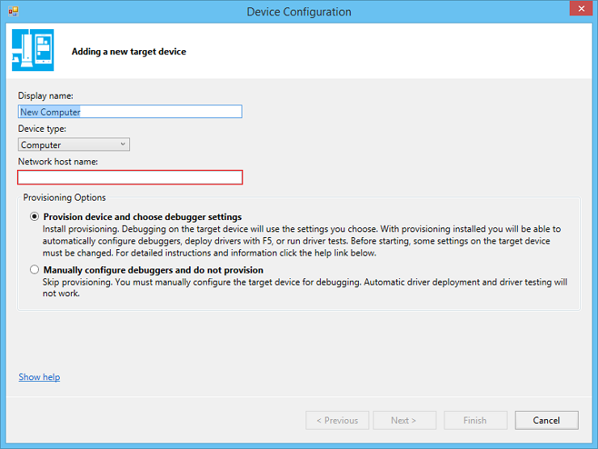

## Provision a computer for driver deployment and testing (WDK 10)
원본 URL : https://msdn.microsoft.com/en-us/library/windows/hardware/dn745909

### Prepare the target computer for provisioning
1. 테스트할 os 설치하고

1. x86, x64 컴퓨터이고, Secure Boot 이 활성화되어있다면 끈다. UEFI 와 Secure Boot 에 관해서는 [UEFI Firmware](https://technet.microsoft.com/ko-kr/library/hh824898.aspx)를 참고. ARM 프로세서인 경우 **Windows Debug Policy** 를 설치한다. 요건 MS 나 제조사에 의해서만 가능하다. 넌 Secure Boot 를 disable 할 필요가 없다. 

1. 타겟 컴퓨터에 타겟 호스트의 플랫폼에 맞는 **WDK Test Target Setup MSI** 를 설치한다. 요놈은 **Windows Driver Kit (WDK)** 설치 경로의 **Remote** 폴더 아래에 있다. 예를 들면 `C:\Program Files (x86)\Windows Kits\10\Remote\x64\WDK Test Target Setup x64-x64_en-us.msi`

1. 타겟 컴퓨터가 N 또는 KN 버전이면 **Media Feature Pack for N and KN versions of Windows** 를 설치한다. 
	- [Media Feature Pack for N and KN versions of Windows 8.1](https://www.microsoft.com/ko-kr/download/details.aspx?id=40744)
	- [Media Feature Pack for N and KN versions of Windows 8](https://www.microsoft.com/ko-kr/download/details.aspx?id=30685)
	- [Media Feature Pack for N and KN versions of Windows 7](https://www.microsoft.com/ko-kr/download/details.aspx?id=16546)
1. 타겟컴퓨터에 Windows Server 가 실행중이라면, **WDK Test Target Setup MSI** 가 생성한 DriverTest 폴더(**C:\DriverTest**)를 오른쪽 클릭 > 속성 > Security 탭에서 **Authenticated Users** 그룹에 **Modify** 권한을 줘라.

호스트와 타겟간에 ping 이 되는지 확인한다. (컴퓨터 이름으로...)

만일 호스트와 타겟이 workgroup 에 속해있고, 다른 서브넷에 존재하는 경우 방화벽설정을 변경해서 호스트와 타겟이 서로 통신할 수 있게 해야 한다. 

1. 타겟 컴퓨터의 제어판 > Network and Internet > Network Sharing Center 로가서 활성화된 네트워크를 확인한다. **Public network, Private Network** 또는 **Domain** 일거다. 
1. 타겟 컴퓨터의 제어판 > System and Security > Windows Firewall > Advanced Settings > Inbound Rules 로 간다. 
1. Inbound Rules 에서 활성화된 네트워크의 모든 Network Discovery 규칙들을 찾는다 (예를들어, Private 의 Profile 을 가진 모든 Network Discovery 규칙들을 찾는다). 각각의 룰을 더블클릭하고, **Scope** 탭을 열고, **Remote IP address** 의 **Any IP address** 를 선택한다. 
1. Inbound 규칙 리스트에서 활성화된 네트워크의 **File and Printer Sharing** 규칙들을 모두 찾는다.  각각의 룰을 더블클릭 > **Scope** 탭 > **Remote IP address** > **Any IP address** 를 선택한다.

### Provision the target computer
이제 호스트의 Visual Studio 에서 타겟 Provision 할 준비가 끝났다.

1. 호스트 Visual Studio > Driver > Test > Configure Devices > Add new device 를 선택
1. **Nework host name** 에 타겟의 이름을 입력하고, **Provision device and choose debugger settings** 를 선택한다.

**Next** 를 선택한다.
1. debugging 타입을 선택하고, 필요한 파라미터들을 입력한다. 다양한 연결 타입에 대한 추가정보는 CHM 파일내 [Setting Up Kernel-Mode Debugging Visual Studio](https://msdn.microsoft.com/ko-kr/library/windows/hardware/hh439376(v=vs.85).aspx) 또는 온라인 문서 [Debugging Tools for Windows](https://msdn.microsoft.com/ko-kr/library/windows/hardware/ff551063(v=VS.85).aspx)를 참고해라.
1. provisioning 과정은 몇분정도 걸리고, 자동으로 한번 또는 두번 타겟을 리부팅한다. provisioning 이 완료되면 **Finish** 버튼을 클릭~!
