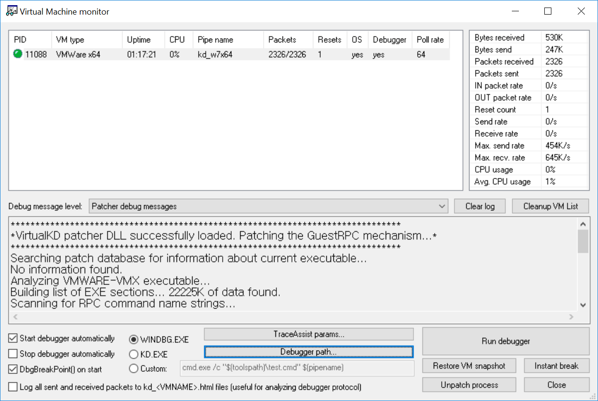
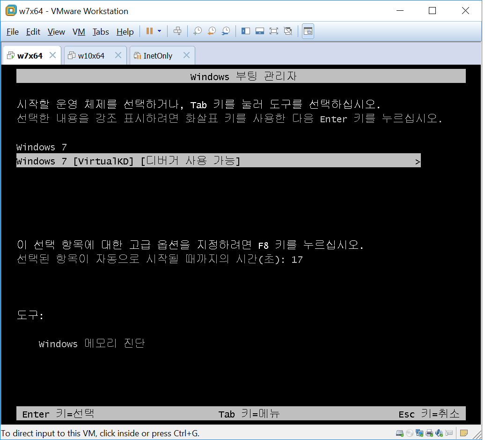
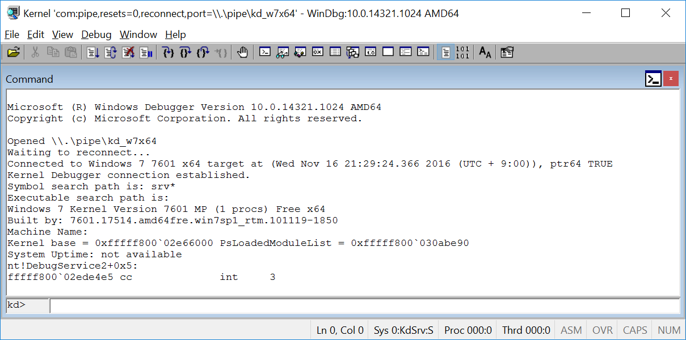

# Setting up debugging environment

## 커널디버깅 환경 설정 
### Debugger 설정 
1. [VirtualKD](http://virtualkd.sysprogs.org/) 를 다운로드하고, `c:\work.utils\VirtualKD` 에 압축을 푼다.
1. `Virtual machine monitor`(`C:\work.utils\VirtualKD-3.0\vmmon64.exe`) 를 실행한다.

1. `debugger path` 버튼을 클릭하고, WinDbg 의 경로를 지정한다. 경로는 아마도 `c:\Program Files (x86)\Windows Kits\10\Debuggers\x64\windbg.exe` 쯤 될것이다.
1. Debuggee 가상머신을 부팅하기 전에 debugger 상의 `Virtual Machine Monitor` 가 실행중이어야만 디버깅이 가능하므로 항상 켜두자.

### Debuggee 설정 
1. [VirtualKD](http://virtualkd.sysprogs.org/) 를 다운로드하고, `c:\VirtualKD` 에 압축을 푼다. 
1. `c:\VirtualKD\target\vminstall.exe` 를 실행, 디버그 모드 부트 엔트리를 생성한 후 리부팅 한다.
    
1. 재 부팅을 하게되면 debugger 에 WinDbg 가 실행되면서 디버깅이 가능한 상태가 되는데, `F5` 또는 `g` 명령을 통해 debuggee 를 계속 실행한다. 
    

## 개발환경 설정
1. [Download the WDK, WinDbg, and associated tools](https://developer.microsoft.com/en-us/windows/hardware/windows-driver-kit) 페이지를 참고, Visual studio, WDK 등을 설치한다.
1. [Windows driver samples](https://github.com/Microsoft/Windows-driver-samples) 를 `c:\windows-driver-samples` 경로에 clone 한다. 
    
## Debuggee 환경설정
1. 실행파일이 위치할 경로를 생성하고, 해당 경로를 네트워크 공유한다.
        
        c:> mkdir c:\dbg
        c:> net share dbg=c:\dbg /grant:vmuser,FULL
        C:\>net share

        공유 이름   리소스                        설명

        ---------------------------------------------------------------------
        C$           C:\                             기본 공유
        IPC$                                         원격 IPC
        ADMIN$       C:\Windows                      원격 관리
        dbg          c:\dbg     <<<!!
1. [Driver Loader](http://www.osronline.com/article.cfm?name=osrloaderv30.zip&id=157)를 다운로드하고, 적당한 경로에 압축을 푼다.  

## Build solution and copy executable files to debuggee
1. build [avscan](https://github.com/Microsoft/Windows-driver-samples/tree/master/filesys/miniFilter/avscan) sample solution probably on `c:\Windows-driver-samples\filesys\miniFilter\avscan\avscan.sln`.
1. 솔루션 빌드시 x86 이 아니라 x64 를 빌드해야 한다.   
1. copy `avscan.exe` and `avscan.sys` to debuggee using share folder.
    
        C:\Users\somma>net use x: \\192.168.0.128\dbg /user:vmuser ryckfh123
        The command completed successfully.
        
        c:\Users\somma>copy c:\Windows-driver-samples\filesys\miniFilter\avscan\user\Debug\avscan.exe x:\
        1 file(s) copied.

        c:\Users\somma>copy c:\Windows-driver-samples\filesys\miniFilter\avscan\filter\Debug\avscan.sys x:\
        1 file(s) copied.

        c:\Users\somma>

## Run and debug filter driver
1. `Driver Loader` 를 실행하고, Driver Path를 지정하고, Type 을 MiniFilter 로 설정하고, Register Service -> Start Service 버튼을 차례로 클릭한다.
1. 뭔가 잘 되었다는 메세지만 나오고, 아무런 일이 벌어지지 않으면 잘 된것입니다. 
1. debugger 에서 실행중인 WinDbg 에서 break 를 걸고 아래 명령을 수행 후 debuggee 실행을 재개하면 수많은 로그 메세지를 확인할 수 있다.

        kd> ed nt!kd_default_mask 0xffffffff

# 참고
## Driver Signing
Windows vista 이후 [Kernel-mode code signing policy](https://msdn.microsoft.com/en-us/windows/hardware/drivers/install/kernel-mode-code-signing-policy--windows-vista-and-later-)로 인해 전자서명되지 않는 드라이버는 로드되지 않는다. 자세한 내용은 [Driver Signing](https://msdn.microsoft.com/en-us/windows/hardware/drivers/install/driver-signing) 페이지를 참고한다.  개발단계에서 이런 문제를 극복하기 위해 self-signed 된 드라이버를 로드할 수 있는 방법을 제공한다.

### Test-Sign 된 드라이버 로딩하기 
test certificate 가 시스템에 제대로 설치되어있고, `Test-signing` 이 활성화되어있으면 로드할 수 있다. 
자세한 내용은 [The TESTSIGNING Boot Configuration Option](https://msdn.microsoft.com/en-us/windows/hardware/drivers/install/the-testsigning-boot-configuration-option) 를 참조한다. 

그런데 VirtualKD 를 사용하면 이런 설정을 알아서 다 해준다. 따로 뭘 할게 없음 :-)