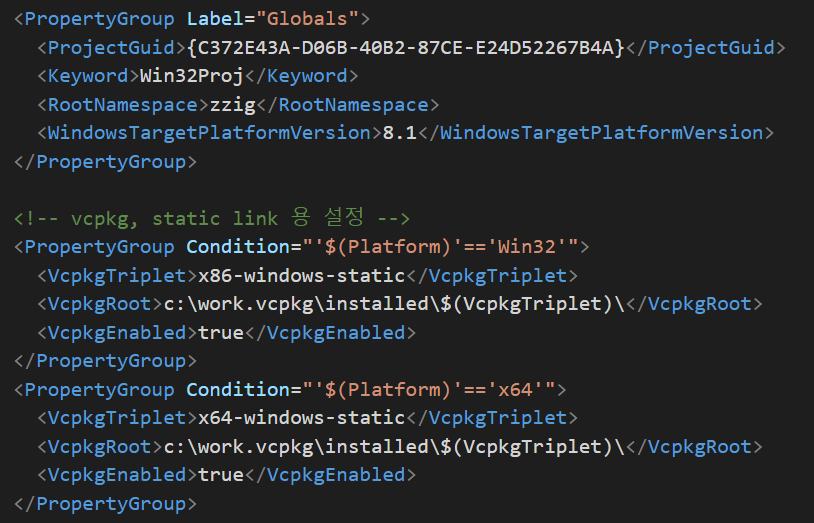
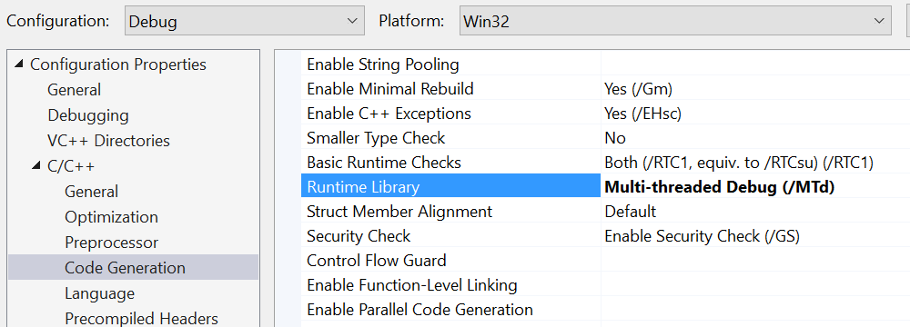
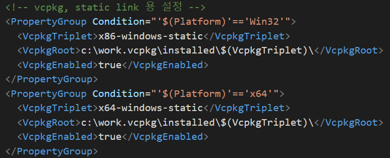

# vcpkg

vcpkg는 curl, boost, openssl 같은 자주 사용되는 3rd party 라이브러리들을 Visual Studio 에서 쉽게 사용할 수 있게 해주는 패키지 매니저입니다. openssl 같은 라이브러를 직접 빌드하려면 정말 귀찮고, 짜증 나는데 vcpkg 를 사용하면 이런 귀찮은 일들을 알아서 자동으로 다 해줍니다. 

## Quick start

vcpkg 를 사용하려면 [github](https://github.com/Microsoft/vcpkg) 을 clone 하고, 로컬에서 빌드만 하면 됩니다. Visual Studio 가 참조하는 헤더파일, 라이브러리 경로 설정들도 자동으로 다 해줍니다.

1. `c:\work.vcpkg` 에 clone 한다. (경로는 편한대로 알아서 하면 됩니다)
1. `c:\work.vcpkg\bootstrap-vcpkg.bat` 을 실행하면 `vcpkg.exe` 를 생성합니다.
1. `vcpkg integrate install` 명령으로 Visual Studio 설정을 해줍니다. (최초 실행시 관리자 권한 필요)
1. `vcpkg.exe` 을 통해서 패키지 인스톨/업데이트/삭제 등등을 할 수 있습니다 (쉽습니다).

        C:\work.vcpkg>vcpkg.exe /?
        Commands:
          vcpkg search [pat]              Search for packages available to be built
          vcpkg install <pkg>...          Install a package
          vcpkg remove <pkg>...           Uninstall a package
          vcpkg remove --outdated         Uninstall all out-of-date packages
          vcpkg list                      List installed packages
          vcpkg update                    Display list of packages for updating
          vcpkg hash <file> [alg]         Hash a file by specific algorithm, default SHA512

          vcpkg integrate install         Make installed packages available user-wide. Requires admin privileges on first use
          vcpkg integrate remove          Remove user-wide integration
          vcpkg integrate project         Generate a referencing nuget package for individual VS project use

          vcpkg export <pkg>... [opt]...  Exports a package
          vcpkg edit <pkg>                Open up a port for editing (uses %EDITOR%, default 'code')
          vcpkg import <pkg>              Import a pre-built library
          vcpkg create <pkg> <url>
                    [archivename]        Create a new package
          vcpkg owns <pat>                Search for files in installed packages
          vcpkg cache                     List cached compiled packages
          vcpkg version                   Display version information
          vcpkg contact                   Display contact information to send feedback

        Options:
          --triplet <t>                   Specify the target architecture triplet.
                                          (default: %VCPKG_DEFAULT_TRIPLET%, see 'vcpkg help triplet')

          --vcpkg-root <path>             Specify the vcpkg root directory
                                          (default: %VCPKG_ROOT%)

        For more help (including examples) see the accompanying README.md.

        C:\work.vcpkg>

## 라이브러리 설치

`vcpkg.exe install package` 명령으로 패키지(라이브러리)를 설치하면 기본적으로 x86 dynamic 으로 설치합니다. 하지만 개발환경에 따라서 x86 static/dynamic, x64 static/dynamic 버전 등등이 필요합니다. 사용가능 한 버전은 `vcpkg install package:triplet` 명령으로 확인가능합니다.

    C:\work.vcpkg>vcpkg help triplet
    Available architecture triplets:
      arm-uwp
      x64-uwp
      x64-windows-static
      x64-windows
      x86-uwp
      x86-windows-static
      x86-windows

`>vcpkg install package:triplet` 명령으로 설치 각 버전의 라이브러리를 설치할 수 있습니다. 아래 예제는 boost, curl, sqlite 등의 라이브러리를 설치합니다.

    >vcpkg install boost:x86-windows boost:x86-windows-static boost:x64-windows boost:x64-windows-static
    >vcpkg install curl:x86-windows curl:x86-windows-static curl:x64-windows curl:x64-windows-static
    >vcpkg install sqlite3:x86-windows sqlite3:x86-windows-static sqlite3:x64-windows sqlite3:x64-windows-static
    >vcpkg install jsoncpp:x86-windows jsoncpp:x86-windows-static jsoncpp:x64-windows jsoncpp:x64-windows-static
    >vcpkg install gtest:x86-windows gtest:x86-windows-static gtest:x64-windows gtest:x64-windows-static

설치된 패키지는 Visual Studio 에서 별다른 설정을 하지 않아도 바로 사용가능합니다.

## 라이브러리 강제 지정하기 (x86, x64 또는 /MD, /MT)

vcpkg 는 기본으로 /MD (Multi Threaded DLL) 로 라이브러리를 빌드하고, 참조하게 합니다. 하지만 프로젝트 환경에 따라서 static 하게 링크해야 하는 경우도 있습니다. 패키지 컴파일시에 `triplet` 을 지정해서 /MD, /MT 등으로 설치는 가능한데, 어떻게 지정하는지에 대해서는 공식적인 내용을 찾지 못했습니다. 구글의 도움을 받아 찾은 해결책은 몇 가지 있었습니다만 깔끔하게 해결할 수 있는 방법은 아직 모르겠습니다. 아시는 분께서는 좀 알려주세요.

+ default 가 md (using dll) 로 링크되는데, 관련 설명은 있는데, 어떻게 하라는것인지 잘 모르겠고, 읽기도 귀찮음.

  + [vcpkg-updates-static-linking-is-now-available](https://blogs.msdn.microsoft.com/vcblog/2016/11/01/vcpkg-updates-static-linking-is-now-available/)
  + [Disable automatic integration for a particuar VS project](https://github.com/Microsoft/vcpkg/issues/281)

+ `c:\work.vcpkg\scripts\buildsystems\msbuild\vcpkg.targets` 파일을 수정하는 방법
  + 프로젝트 빌드 과정에서 참조되는 파일로 `VcpkgEnabled`, `VcpkgTriplet` 변수를 적당히 수정해주면 됨
  + 전역 파일을 수정하는것이 맘에 들지 않음.

저는 아래 처럼 프로젝트의 설정파일을 직접 편집합니다. 편한 텍스트 에디터를 이용해서 `.vcxproj` 파일을 열고, `Globals` 아래에 내용을 추가합니다. vcpkg 로 패키지를 설치하면 `vcpkg-root\installed\x64-windows`, `vcpkg-root\installed\x64-windows-static` 등의 경로에 패키지가 설치되는데 이 경로를 강제로 지정하는 것입니다. Visual Studio 에서 사용하는 `VcpkgRoot` 환경변수를 바꿔치기 해주는 것이지요. :-)

## curl 라이브러리 문제 해결하기

curl 라이브러리는 아주 많은 application network protocol 구현을 제공하는 라이브러리입니다. 디폴트 동작방식인 `/MD` 라면 추가적인 설정이 필요없지만 static link 를 사용하는 경우 추가적인 설정이 필요합니다. 우선 static 링크를 사용하기 위해서 c/c++ -> Runtime Library 를 `/MT` 로 변경합니다.

`vcxproj` 파일도 static 버전을 참조할 수 있도록 수정합니다.

### CURL_STATICLIB

프로젝트를 빌드하면 아래와 유사한 에러가 발생합니다.

    1>libcurl.lib(schannel.obj) : error LNK2019: unresolved external symbol __imp__CertFreeCertificateContext@4 referenced in function _schannel_connect_step3
    1>libeay32.lib(e_capi.obj) : error LNK2001: unresolved external symbol __imp__CertFreeCertificateContext@4
    1>libcurl.lib(ldap.obj) : error LNK2019: unresolved external symbol __imp__ldap_init referenced in function __ldap_free_urldesc
    1>libcurl.lib(ldap.obj) : error LNK2019: unresolved external symbol __imp__ldap_unbind_s referenced in function __ldap_free_urldesc
    1>libcurl.lib(ldap.obj) : error LNK2019: unresolved external symbol __imp__ldap_set_option referenced in function __ldap_free_urldesc
    1>libcurl.lib(ldap.obj) : error LNK2019: unresolved external symbol __imp__ldap_simple_bind_s referenced in function __ldap_free_urldesc
    1>libcurl.lib(ldap.obj) : error LNK2019: unresolved external symbol __imp__ldap_search_s referenced in function __ldap_free_urldesc
    1>libcurl.lib(ldap.obj) : error LNK2019: unresolved external symbol __imp__ldap_msgfree referenced in function __ldap_free_urldesc
    1>libcurl.lib(ldap.obj) : error LNK2019: unresolved external symbol __imp__ldap_err2string referenced in function __ldap_free_urldesc
    1>libcurl.lib(ldap.obj) : error LNK2019: unresolved external symbol __imp__ldap_first_entry referenced in function __ldap_free_urldesc
    1>libcurl.lib(ldap.obj) : error LNK2019: unresolved external symbol __imp__ldap_next_entry referenced in function __ldap_free_urldesc
    1>libcurl.lib(ldap.obj) : error LNK2019: unresolved external symbol __imp__ldap_first_attribute referenced in function __ldap_free_urldesc
    1>libcurl.lib(ldap.obj) : error LNK2019: unresolved external symbol __imp__ldap_next_attribute referenced in function __ldap_free_urldesc
    1>libcurl.lib(ldap.obj) : error LNK2019: unresolved external symbol __imp__ldap_get_values_len referenced in function __ldap_free_urldesc
    1>libcurl.lib(ldap.obj) : error LNK2019: unresolved external symbol __imp__ldap_value_free_len referenced in function __ldap_free_urldesc
    1>libcurl.lib(ldap.obj) : error LNK2019: unresolved external symbol __imp__ldap_get_dn referenced in function __ldap_free_urldesc
    1>libcurl.lib(ldap.obj) : error LNK2019: unresolved external symbol __imp__ldap_memfree referenced in function __ldap_free_urldesc
    1>libcurl.lib(ldap.obj) : error LNK2019: unresolved external symbol __imp__ber_free referenced in function __ldap_free_urldesc
    1>libeay32.lib(e_capi.obj) : error LNK2019: unresolved external symbol __imp__CertOpenStore@20 referenced in function _capi_open_store
    1>libeay32.lib(e_capi.obj) : error LNK2019: unresolved external symbol __imp__CertCloseStore@8 referenced in function _capi_find_key
    1>libeay32.lib(e_capi.obj) : error LNK2019: unresolved external symbol __imp__CertEnumCertificatesInStore@8 referenced in function _capi_find_cert
    1>libeay32.lib(e_capi.obj) : error LNK2019: unresolved external symbol __imp__CertFindCertificateInStore@24 referenced in function _capi_find_cert
    1>libeay32.lib(e_capi.obj) : error LNK2019: unresolved external symbol __imp__CertDuplicateCertificateContext@4 referenced in function _capi_load_ssl_client_cert
    1>libeay32.lib(e_capi.obj) : error LNK2019: unresolved external symbol __imp__CertGetCertificateContextProperty@16 referenced in function _capi_cert_get_fname
    1>C:\work.zzig\out\x86_debug\update_host.exe : fatal error LNK1120: 23 unresolved externals

이 문제는 `CURL_STATICLIB` 전처리기를 정의하면 됩니다. 아래 처럼 `curl.h` 를 include 하기 전에 정의해도 되고, project 설정파일에 정의해주어도 됩니다. 

    #define CURL_STATICLIB
    #include "curl/curl.h"

사실 이 문제는 vcpkg 의 문제가 아니라 curl 라이브러리 구현상의 특징이며 `curl/curl.h` 파일에 관련된 코드가 있습니다.

    /*
    * libcurl external API function linkage decorations.
    */

    #ifdef CURL_STATICLIB
    #  define CURL_EXTERN
    #elif defined(WIN32) || defined(_WIN32) || defined(__SYMBIAN32__)
    #  if defined(BUILDING_LIBCURL)
    #    define CURL_EXTERN  __declspec(dllexport)
    #  else
    #    define CURL_EXTERN  __declspec(dllimport)
    #  endif
    #elif defined(BUILDING_LIBCURL) && defined(CURL_HIDDEN_SYMBOLS)
    #  define CURL_EXTERN CURL_EXTERN_SYMBOL
    #else
    #  define CURL_EXTERN
    #endif

### crypt32.lib 에러

하지만 여전히 또 다른 링크에러들이 발생합니다.

    >libcurl.lib(schannel.obj) : error LNK2019: unresolved external symbol __imp__CertFreeCertificateContext@4 referenced in function _schannel_connect_step3
    1>libeay32.lib(e_capi.obj) : error LNK2001: unresolved external symbol __imp__CertFreeCertificateContext@4
    1>libcurl.lib(ldap.obj) : error LNK2019: unresolved external symbol __imp__ldap_init referenced in function __ldap_free_urldesc
    1>libcurl.lib(ldap.obj) : error LNK2019: unresolved external symbol __imp__ldap_unbind_s referenced in function __ldap_free_urldesc
    1>libcurl.lib(ldap.obj) : error LNK2019: unresolved external symbol __imp__ldap_set_option referenced in function __ldap_free_urldesc
    1>libcurl.lib(ldap.obj) : error LNK2019: unresolved external symbol __imp__ldap_simple_bind_s referenced in function __ldap_free_urldesc
    1>libcurl.lib(ldap.obj) : error LNK2019: unresolved external symbol __imp__ldap_search_s referenced in function __ldap_free_urldesc
    1>libcurl.lib(ldap.obj) : error LNK2019: unresolved external symbol __imp__ldap_msgfree referenced in function __ldap_free_urldesc
    1>libcurl.lib(ldap.obj) : error LNK2019: unresolved external symbol __imp__ldap_err2string referenced in function __ldap_free_urldesc
    1>libcurl.lib(ldap.obj) : error LNK2019: unresolved external symbol __imp__ldap_first_entry referenced in function __ldap_free_urldesc
    1>libcurl.lib(ldap.obj) : error LNK2019: unresolved external symbol __imp__ldap_next_entry referenced in function __ldap_free_urldesc
    1>libcurl.lib(ldap.obj) : error LNK2019: unresolved external symbol __imp__ldap_first_attribute referenced in function __ldap_free_urldesc
    1>libcurl.lib(ldap.obj) : error LNK2019: unresolved external symbol __imp__ldap_next_attribute referenced in function __ldap_free_urldesc
    1>libcurl.lib(ldap.obj) : error LNK2019: unresolved external symbol __imp__ldap_get_values_len referenced in function __ldap_free_urldesc
    1>libcurl.lib(ldap.obj) : error LNK2019: unresolved external symbol __imp__ldap_value_free_len referenced in function __ldap_free_urldesc
    1>libcurl.lib(ldap.obj) : error LNK2019: unresolved external symbol __imp__ldap_get_dn referenced in function __ldap_free_urldesc
    1>libcurl.lib(ldap.obj) : error LNK2019: unresolved external symbol __imp__ldap_memfree referenced in function __ldap_free_urldesc
    1>libcurl.lib(ldap.obj) : error LNK2019: unresolved external symbol __imp__ber_free referenced in function __ldap_free_urldesc
    1>libeay32.lib(e_capi.obj) : error LNK2019: unresolved external symbol __imp__CertOpenStore@20 referenced in function _capi_open_store
    1>libeay32.lib(e_capi.obj) : error LNK2019: unresolved external symbol __imp__CertCloseStore@8 referenced in function _capi_find_key
    1>libeay32.lib(e_capi.obj) : error LNK2019: unresolved external symbol __imp__CertEnumCertificatesInStore@8 referenced in function _capi_find_cert
    1>libeay32.lib(e_capi.obj) : error LNK2019: unresolved external symbol __imp__CertFindCertificateInStore@24 referenced in function _capi_find_cert
    1>libeay32.lib(e_capi.obj) : error LNK2019: unresolved external symbol __imp__CertDuplicateCertificateContext@4 referenced in function _capi_load_ssl_client_cert
    1>libeay32.lib(e_capi.obj) : error LNK2019: unresolved external symbol __imp__CertGetCertificateContextProperty@16 referenced in function _capi_cert_get_fname
    1>C:\work.zzig\out\x86_debug\update_host.exe : fatal error LNK1120: 23 unresolved externals

`CertFindCertificateInStore` 등의 함수는 `crypt32.lib` 에서 export 하는 함수이므로 아래처럼 해당 라이브러리를 link 해주거나 visual studio 의 link 옵션에서 지정해주면 됩니다.

    #define CURL_STATICLIB
    #include "curl/curl.h"
    #pragma comment(lib, "crypt32.lib")

### wldap32.lib 에러

하지만 여전히 또 다른 링크에러들이 발생합니다. 

    1>libcurl.lib(ldap.obj) : error LNK2019: unresolved external symbol __imp__ldap_init referenced in function __ldap_free_urldesc
    1>libcurl.lib(ldap.obj) : error LNK2019: unresolved external symbol __imp__ldap_unbind_s referenced in function __ldap_free_urldesc
    1>libcurl.lib(ldap.obj) : error LNK2019: unresolved external symbol __imp__ldap_set_option referenced in function __ldap_free_urldesc
    1>libcurl.lib(ldap.obj) : error LNK2019: unresolved external symbol __imp__ldap_simple_bind_s referenced in function __ldap_free_urldesc
    1>libcurl.lib(ldap.obj) : error LNK2019: unresolved external symbol __imp__ldap_search_s referenced in function __ldap_free_urldesc
    1>libcurl.lib(ldap.obj) : error LNK2019: unresolved external symbol __imp__ldap_msgfree referenced in function __ldap_free_urldesc
    1>libcurl.lib(ldap.obj) : error LNK2019: unresolved external symbol __imp__ldap_err2string referenced in function __ldap_free_urldesc
    1>libcurl.lib(ldap.obj) : error LNK2019: unresolved external symbol __imp__ldap_first_entry referenced in function __ldap_free_urldesc
    1>libcurl.lib(ldap.obj) : error LNK2019: unresolved external symbol __imp__ldap_next_entry referenced in function __ldap_free_urldesc
    1>libcurl.lib(ldap.obj) : error LNK2019: unresolved external symbol __imp__ldap_first_attribute referenced in function __ldap_free_urldesc
    1>libcurl.lib(ldap.obj) : error LNK2019: unresolved external symbol __imp__ldap_next_attribute referenced in function __ldap_free_urldesc
    1>libcurl.lib(ldap.obj) : error LNK2019: unresolved external symbol __imp__ldap_get_values_len referenced in function __ldap_free_urldesc
    1>libcurl.lib(ldap.obj) : error LNK2019: unresolved external symbol __imp__ldap_value_free_len referenced in function __ldap_free_urldesc
    1>libcurl.lib(ldap.obj) : error LNK2019: unresolved external symbol __imp__ldap_get_dn referenced in function __ldap_free_urldesc
    1>libcurl.lib(ldap.obj) : error LNK2019: unresolved external symbol __imp__ldap_memfree referenced in function __ldap_free_urldesc
    1>libcurl.lib(ldap.obj) : error LNK2019: unresolved external symbol __imp__ber_free referenced in function __ldap_free_urldesc

이 에러는 아래처럼 `wldap32.lib` 을 link 해주면 해결됩니다.

    #define CURL_STATICLIB
    #include "curl/curl.h"
    #pragma comment(lib, "crypt32.lib")
    #pragma comment(lib, "wldap32.lib")

### LNK4099 링크 경고

    1>libcurl.lib(file.obj) : warning LNK4099: PDB 'libcurl.pdb' was not found with 'libcurl.lib(file.obj)' or at 'C:\work.zzig\out\x86_release\libcurl.pdb'; linking object as if no debug info
    1>libcurl.lib(timeval.obj) : warning LNK4099: PDB 'libcurl.pdb' was not found with 'libcurl.lib(timeval.obj)' or at 'C:\work.zzig\out\x86_release\libcurl.pdb'; linking object as if no debug info

모든 설정을 다 하고 빌드하면 `LNK4099` 경고가 발생하는데, 이건 어떻게 해야할지 모르겠네요. 아시는 분은 알려주십셔 (ㅠ,.ㅠ)