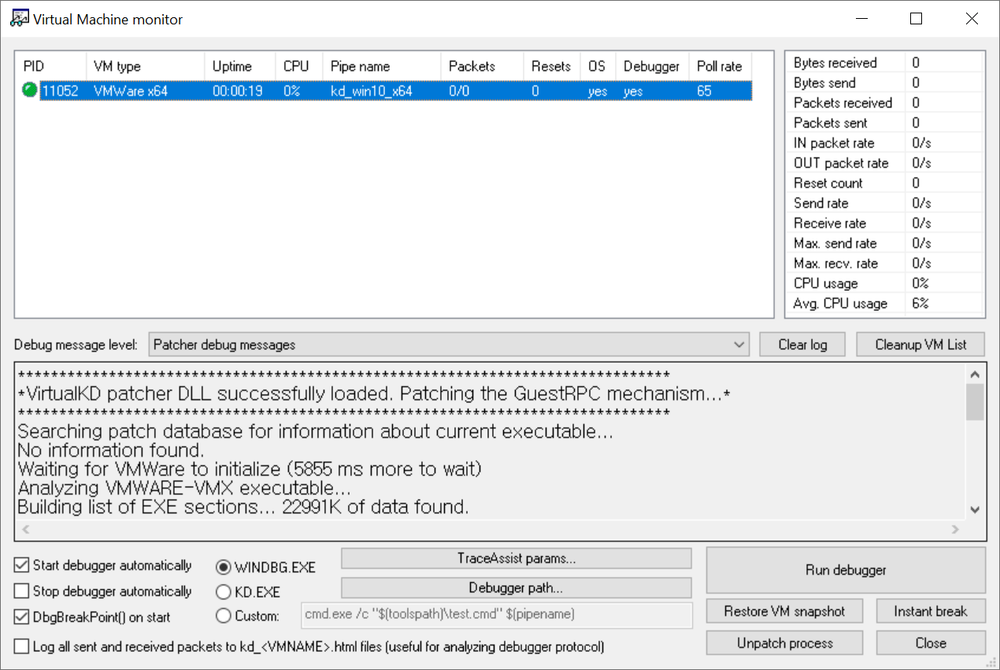
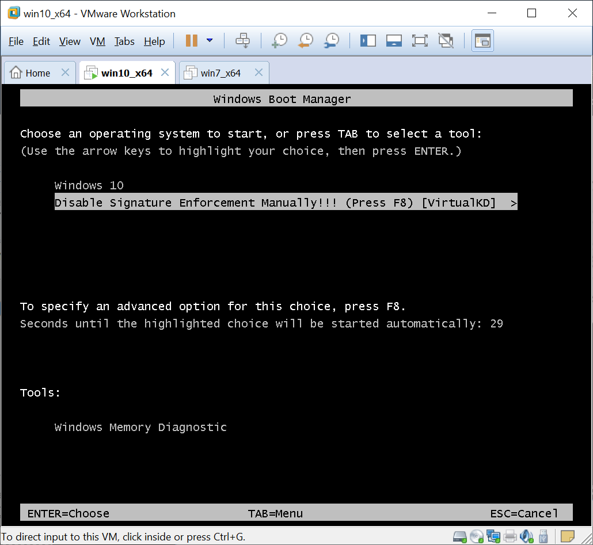
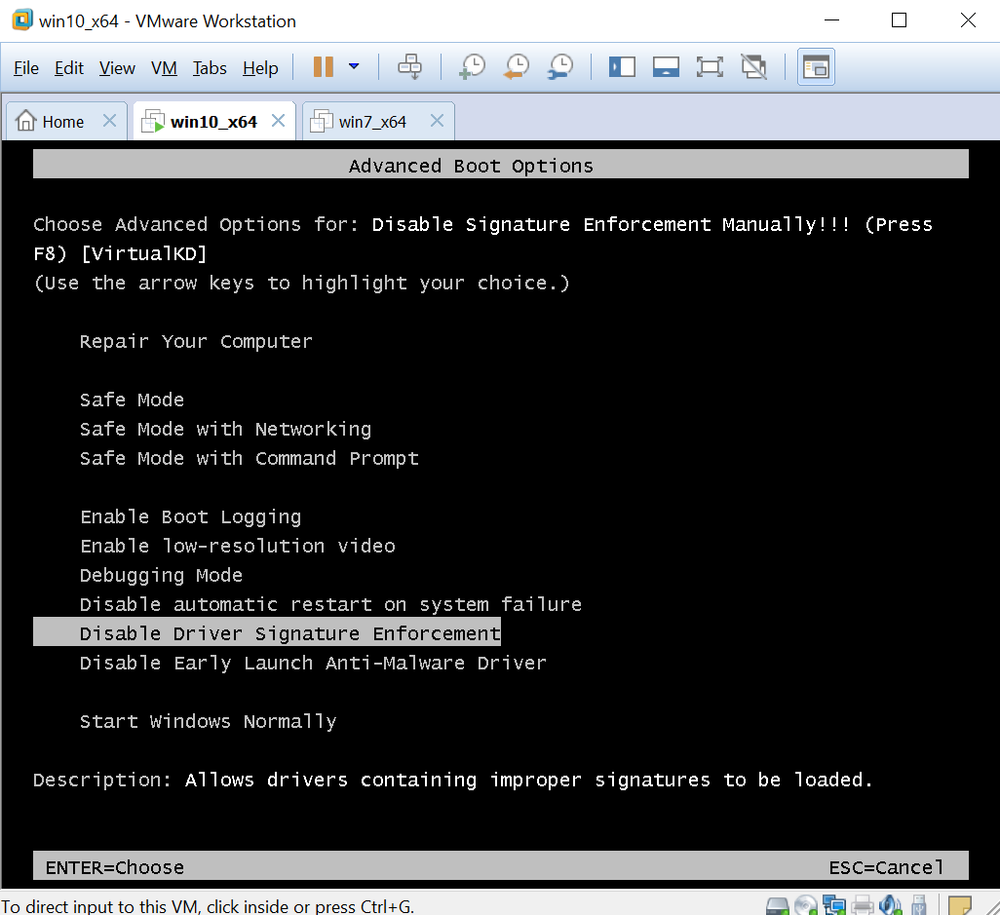

# VirtualKD on Windows 10

## Debugger 설정 
1. [VirtualKD](http://virtualkd.sysprogs.org/) 를 다운로드하고, `c:\work.utils\VirtualKD` 에 압축을 푼다.
1. `Virtual machine monitor`(`C:\work.utils\VirtualKD-3.0\vmmon64.exe`) 를 실행한다.

1. `debugger path` 버튼을 클릭하고, WinDbg 의 경로를 지정한다. 경로는 아마도 `c:\Program Files (x86)\Windows Kits\10\Debuggers\x64\windbg.exe` 쯤 될것이다.
1. Debuggee 가상머신을 부팅하기 전에 debugger 상의 `Virtual Machine Monitor` 가 실행중이어야만 디버깅이 가능하므로 항상 켜두자.

## Debuggee 설정 
1. [VirtualKD](http://virtualkd.sysprogs.org/) 를 다운로드하고, `c:\VirtualKD` 에 압축을 푼다. 
1. `c:\VirtualKD\target\vminstall.exe` 를 실행, 디버그 모드 부트 엔트리를 생성한 후 리부팅 한다.
    

1. 서명이 검증되지 않은 드라이버를 로딩하기 위해서는 Advanced Boot option 화면에서 `F8` 을 눌러서 `Disable driver signature enforcement` 항목을 선택하고 부팅을 해야 한다.
    

1. 재 부팅을 하게되면 debugger 에 WinDbg 가 실행되면서 디버깅이 가능한 상태가 되는데, `F5` 또는 `g` 명령을 통해 debuggee 를 계속 실행한다. 
    

## 문제들

가상머신(Debuggee)에서 vminstall.exe 를 설치했고 디버그 모드로 부팅이 되었음에도 불구하고, WinDbg 연결이 안되는 경우가 있다. 여러 가지 이유가 있을 수 있겠지만 보통 필요한 파일이 제대로 설치되지 않았거나 디버그 모드 부트옵션등이 제대로 설정되지 않은경우가 대부분이다. 

1. (가상머신에서) `VirtualKD\target\x64` 아래 `kdbazis.dll`, `kdpatch.sys` 파일을 `c:\windows\system32\drivers` 디렉토리에 복사한다. 
1. (가상머신에서) `VirtualKD\target\kdpatch.reg` 를 실행해서 레지스트리를 설정한다.     
1. (가상머신에서) `bcdedit /dbgsettings` 명령으로 디버그 설정이 제대로 되었는지 확인한다. 

        PS C:\Windows\system32> bcdedit /dbgsettings
        debugtype               Serial
        debugport               1
        baudrate                115200
        The operation completed successfully.

    가끔 `debugtype` 이 `local` 로 되어있는 경우가 있는데, 아래 명령을 통해서 `serial` 타입으로 변경해 주어야 한다.
    
        PS C:\Windows\system32> bcdedit /dbgsettings serial debugport:1 baudrate:115200

1. (호스트에서) `vmmon64.exe` 을 실행한 상태에서 가상머신을 재 부팅하고, 디버그 모드로 부팅하면 WinDbg 가 연결이 된다. 

    