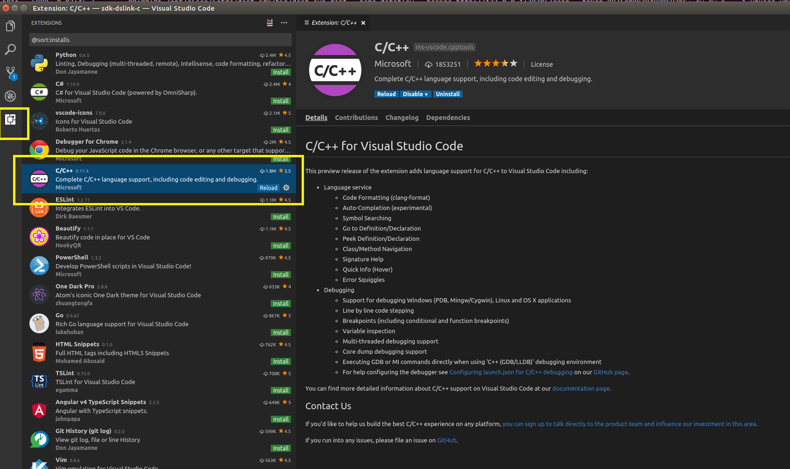
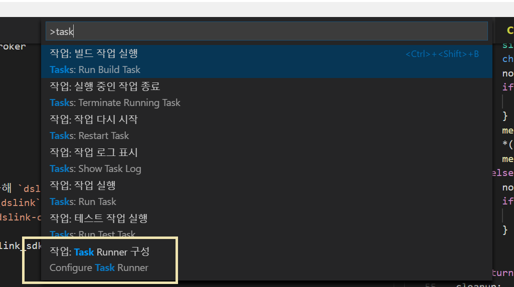
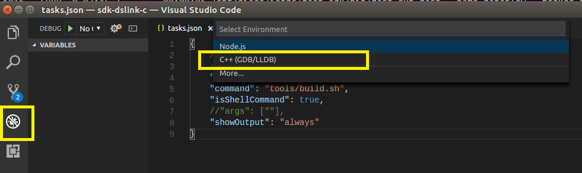

# EFF work

## CentOS 가상머신 환경
+ namooinc 에서 제공한 eff 서버가 설치된 가상머신 이미지
+ `CentOSForEFF.ova` 를 Virtual box 로 import 
+ CentOSForEFF 이미지 계정
    
      surixxxx/Nxxxxinc123xxx
      root/Nxxxxinc123xxx
   
+ 원격 접속을 위해 `systemctl stop firewalld` 실행

## EFF 1.0 on Ubuntu

  + `EFF-1.0` 패키지내 install guide 대로 하면 한방에 설치 됨 (`eff-linux install`)

## dslink sdk 개발 환경 설정

linux 에 모든 소스코드를 저장한다. samba 를 이용해서 windows 에서 linux 에 저장된 소스코드를 수정/분석하고, 빌드 및 디버깅은 linux 에서 진행한다. 
  
### 컴파일 툴체인 설치
      
      $ sudo apt-get build-essential
 
### 파일 공유 설정

linux 에 samba 패키지를 설치한다.

      vmuser@ubuntu:~$ sudo apt-get install samba

windows 에서 접근할 공유폴더를 생성한다. 

      vmuser@ubuntu:~$ mkdir ~/work.eff

samba 에서 사용할 계정의 패스워드를 설정한다. 

      ; vmuser 는 이미 리눅스상에 존재하는 계정
      vmuser@ubuntu:~$ sudo smbpasswd -a vmuser
      New SMB password:
      Retype new SMB password:
      Added user vmuser.

`/etc/samba/smb.conf` 파일의 마지막에 아래 내용을 추가한다.

      [work.eff]
      path = /home/vmuser/work.eff
      available = yes
      valid users = vmuser
      read only = no
      browsable = yes
      public = yes
      writable = yes
      
설정값을 적용하기 위해 `samba` 서비스를 재시작한다.      

      vmuser@ubuntu:~$ sudo service smbd restart

Windows 환경에서 `net use` 등의 명령으로 네트워크 공유를 볼륨으로 매핑해서 소스 코드 인텔리센스 및 심볼매칭이 가능한 에디터(예. Visual studio code, Sublime text)등을 이용해서 코드를 수정하면 된다.

      C:\Users\unsor>net use z: \\10.10.10.130\work.eff
      '10.10.10.130'의 사용자 이름 입력: vmuser
      10.10.10.130의 암호 입력:
      명령을 잘 실행했습니다.

### cloning source code

      $ git clone https://github.com/IOT-DSA/sdk-dslink-c
      $ git clone https://github.com/IOT-DSA/dslink-c-iec61850
      or
      $ git clone https://github.com/somma/sdk-dslink-c
      $ git clone https://github.com/somma/dslink-c-iec61850

## 리눅스에서 Kdevelop IDE 사용하기 

### IDE 설치 
      
      $ sudo apt-get install kdevelop

### 빌드       

`./tools/build.sh` 를 사용하지 않기 위해 `sdk-dslink-c\CMakeList.txt` 의 시작 부분을 아래처럼 수정한다.

    cmake_minimum_required(VERSION 3.0.0 FATAL_ERROR)
    project(sdk_dslink_c C)

    set(DSLINK_BUILD_EXAMPLES ON)
    set(DSLINK_BUILD_BROKER ON)

`kdevelop IDE > Project > Open/Import project` 를 통해 `sdk-dslink-c\CMakeList.txt` 를 선택한다. 

### 실행

+ exmple\requester

      vmuser@ubuntu:~/work.dslink_sdk/sdk-dslink-c/build$ ./requester -b https://localhost:8443/conn
      2017-06-18 07:18:09 WARN [dslink] - Failed to load dslink.json: unable to open dslink.json: No such file or directory
      2017-06-18 07:18:09 WARN [dslink] - Failed to load dslink.json: unable to open dslink.json: No such file or directory
      2017-06-18 07:18:09 INFO [main] - Initialized!
      2017-06-18 07:18:09 INFO [dslink] - Successfully connected to the broker
      2017-06-18 07:18:09 INFO [main] - Connected!

### 디버깅
Projects -> build target 의 컨텍스트 메뉴를 통해 디버깅 가능함

## 리눅스에서 Visual studio code 사용하기

코드 에디팅, 빌드 설정하기가 매우 자유롭고 좋지만, 디버그에서 심볼/소스 매칭을 어떻게 하는지 모르겠음. 디버깅 환경이 kdevelop 이 더 편한거 같아서 더이상 시도 하지 않았으나 기록을 위해 남겨둠.

### 설치

[Microsoft Visual Stdio Code](https://code.visualstudio.com/docs/setup/linux)를 참고, vs code 를 설치하고, [c++ 플러그인을 설치](https://code.visualstudio.com/docs/languages/cpp)한다.

### 빌드 설정

`ctrl+shift+p` -> `Configure Task Runner` -> `Other` 를 선택, 워킹 디렉토리에 `task.json` 파일을 생성한다. 

      task.json

      {
            // See https://go.microsoft.com/fwlink/?LinkId=733558
            // for the documentation about the tasks.json format
            "version": "0.1.0",
            "command": "tools/build.sh",
            "isShellCommand": true,
            //"args": [""],
            "showOutput": "always"
      }

### 디버그 설정

      launch.json

      {
      "version": "0.2.0",
      "configurations": [
            {
                  "name": "(gdb) Launch",
                  "type": "cppdbg",
                  "request": "launch",
                  "program": "${workspaceRoot}/build/responder",            
                  "args": ["-b https://localhost:8443/conn"],
                  "stopAtEntry": true,            
                  "cwd": "${workspaceRoot}",
                  "environment": [],
                  "externalConsole": true,
                  "MIMode": "gdb",
                  "setupCommands": [
                  {
                        "description": "Enable pretty-printing for gdb",
                        "text": "-enable-pretty-printing",
                        "ignoreFailures": true
                  }
                  ]
            }
      ]
      }

## Build sdlink-c-iec61850 

`sdk-dslink-c` 와 동일하게 `kdevelop > Project > Open/Import project` 를 통해 `dslink-c-iec61850\CMakeList.txt` 를 선택하고 빌드하면 된다.
`dslink-c-iec61850\CMakeList.txt` 는 `sdk-dslink-c` 를 `dslink-c-iec61850\dslink` 아래에서 찾아 `sdk-dslink-c` 의 `sdk_dslink_c-static` 타겟을 빌드하고, 빌드한 라이브러리를 링크하기 때문에, `sdk-dslink-c dslink` 경로를 `dslink-c-iec61850\dslink` 에 심볼릭 링크를 걸어준다. 

      vmuser@ubuntu:~/work.dslink_sdk/dslink-c-iec61850$ ln -s  ~/work.dslink_sdk/sdk-dslink-c dslink
      vmuser@ubuntu:~/work.dslink_sdk/dslink-c-iec61850$ ll
      total 48
      drwxrwxr-x  7 vmuser vmuser 4096 Jun 18 07:46 ./
      drwxrwxr-x  4 vmuser vmuser 4096 Jun 18 07:14 ../
      -rw-rw-r--  1 vmuser vmuser  614 Jun 18 07:15 CMakeLists.txt
      lrwxrwxrwx  1 vmuser vmuser   41 Jun 18 07:46 dslink -> /home/vmuser/work.dslink_sdk/sdk-dslink-c/
      drwxrwxr-x  8 vmuser vmuser 4096 Jun 18 07:15 .git/
      -rw-rw-r--  1 vmuser vmuser  144 Jun 18 07:15 .gitignore
      -rw-rw-r--  1 vmuser vmuser   87 Jun 18 07:15 .gitmodules
      drwxrwxr-x  2 vmuser vmuser 4096 Jun 18 07:15 include/
      drwxrwxr-x 11 vmuser vmuser 4096 Jun 18 07:15 libiec61850/
      -rw-rw-r--  1 vmuser vmuser  591 Jun 18 07:15 LICENSE.md
      -rw-rw-r--  1 vmuser vmuser   25 Jun 18 07:15 README.md
      drwxrwxr-x  2 vmuser vmuser 4096 Jun 18 07:15 src/
      vmuser@ubuntu:~/work.dslink_sdk/dslink-c-iec61850$ 

