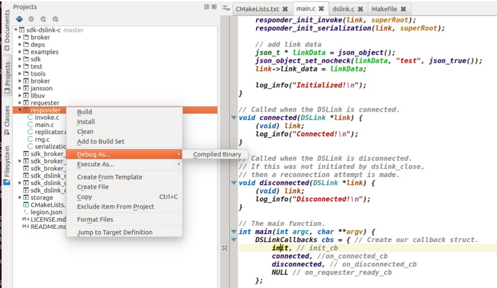

# EFF work

## CentOS 가상머신 환경
+ namooinc 에서 제공한 eff 서버가 설치된 가상머신 이미지
+ `CentOSForEFF.ova` 를 Virtual box 로 import 
+ CentOSForEFF 이미지 계정
    
      surixxxx/Nxxxxinc123xxx
      root/Nxxxxinc123xxx
   
+ 원격 접속을 위해 `systemctl stop firewalld` 실행

## EFF 1.0 on Ubuntu

  + `EFF-1.0` 패키지내 install guide 대로 하면 한방에 설치 됨 (`eff-linux install`)

## sdk dslink c
  
  + build 환경구성 
        
        $ sudo apt-get build-essential
        $ sudo apt-get install kdevelop

  + cloning source code

        $ git clone https://github.com/IOT-DSA/sdk-dslink-c
        $ git clone https://github.com/IOT-DSA/dslink-c-iec61850
        or
        $ git clone https://github.com/somma/sdk-dslink-c
        $ git clone https://github.com/somma/dslink-c-iec61850
  
## Build sdk-dslink-c
`./tools/build.sh` 를 사용하지 않기 위해 `sdk-dslink-c\CMakeList.txt` 의 시작 부분을 아래처럼 수정한다.

    cmake_minimum_required(VERSION 3.0.0 FATAL_ERROR)
    project(sdk_dslink_c C)

    set(DSLINK_BUILD_EXAMPLES ON)
    set(DSLINK_BUILD_BROKER ON)

`kdevelop IDE > Project > Open/Import project` 를 통해 `sdk-dslink-c\CMakeList.txt` 를 선택한다. 

### Run examples

+ exmple\requester

      vmuser@ubuntu:~/work.dslink_sdk/sdk-dslink-c/build$ ./requester -b https://localhost:8443/conn
      2017-06-18 07:18:09 WARN [dslink] - Failed to load dslink.json: unable to open dslink.json: No such file or directory
      2017-06-18 07:18:09 WARN [dslink] - Failed to load dslink.json: unable to open dslink.json: No such file or directory
      2017-06-18 07:18:09 INFO [main] - Initialized!
      2017-06-18 07:18:09 INFO [dslink] - Successfully connected to the broker
      2017-06-18 07:18:09 INFO [main] - Connected!

### Debug examples
Projects -> build target 의 컨텍스트 메뉴를 통해 디버깅 가능함

## Build sdlink-c-iec61850 

`sdk-dslink-c` 와 동일하게 `kdevelop > Project > Open/Import project` 를 통해 `dslink-c-iec61850\CMakeList.txt` 를 선택하고 빌드하면 된다.
`dslink-c-iec61850\CMakeList.txt` 는 `sdk-dslink-c` 를 `dslink-c-iec61850\dslink` 아래에서 찾아 `sdk-dslink-c` 의 `sdk_dslink_c-static` 타겟을 빌드하고, 빌드한 라이브러리를 링크하기 때문에, `sdk-dslink-c dslink` 경로를 `dslink-c-iec61850\dslink` 에 심볼릭 링크를 걸어준다. 

      vmuser@ubuntu:~/work.dslink_sdk/dslink-c-iec61850$ ln -s  ~/work.dslink_sdk/sdk-dslink-c dslink
      vmuser@ubuntu:~/work.dslink_sdk/dslink-c-iec61850$ ll
      total 48
      drwxrwxr-x  7 vmuser vmuser 4096 Jun 18 07:46 ./
      drwxrwxr-x  4 vmuser vmuser 4096 Jun 18 07:14 ../
      -rw-rw-r--  1 vmuser vmuser  614 Jun 18 07:15 CMakeLists.txt
      lrwxrwxrwx  1 vmuser vmuser   41 Jun 18 07:46 dslink -> /home/vmuser/work.dslink_sdk/sdk-dslink-c/
      drwxrwxr-x  8 vmuser vmuser 4096 Jun 18 07:15 .git/
      -rw-rw-r--  1 vmuser vmuser  144 Jun 18 07:15 .gitignore
      -rw-rw-r--  1 vmuser vmuser   87 Jun 18 07:15 .gitmodules
      drwxrwxr-x  2 vmuser vmuser 4096 Jun 18 07:15 include/
      drwxrwxr-x 11 vmuser vmuser 4096 Jun 18 07:15 libiec61850/
      -rw-rw-r--  1 vmuser vmuser  591 Jun 18 07:15 LICENSE.md
      -rw-rw-r--  1 vmuser vmuser   25 Jun 18 07:15 README.md
      drwxrwxr-x  2 vmuser vmuser 4096 Jun 18 07:15 src/
      vmuser@ubuntu:~/work.dslink_sdk/dslink-c-iec61850$ 

